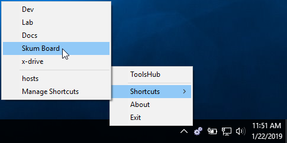

# Xeno.ToolsHub

Flexible tools launcher desktop app which is "_not your average extensible sidebar_"

**_This project is a Work in Progress_**

|||
| --- | --- |
| **License** | [](https://github.com/DamianSuess/ToolsHub/blob/master/LICENSE) |
| **Master** |  |
| **Develop** | [](https://ci.appveyor.com/project/DamianSuess/toolshub/branch/develop) |



Author: [Damian Suess](https://www.linkedin.com/in/damiansuess/)

## Active Features

* Launch app from System Tray
* Add-on extensions via [Mono.Addins](https://github.com/mono/mono-addins)

### Future Features

* Safely send shutdown signals to your add-ons
* Launch app from Sidebar (_i.e. RocketDock, ObjectDock_)
* Launch app on system startup

## Use case

### SystemTray Launcher

* **Status:** Ready
* Launch shortcuts (_apps, folders, urls_) directly from SystemTray

### Sidebar Launcher

* **Status:** _n/a_
* (_i.e. RocketDock, ObjectDock_)

### VeraCrypt

* **Status:** WiP
* Auto-mount drives on startup
* Safely dismount drive on system shutdown to guard against corruption

## Coding

The framework relies on [Mono.Addins](https://github.com/mono/mono-addins) for extending to add new features. We provide a list of key [extension points](https://github.com/xenoinc/ToolsHub/wiki/Addin-ExtensionPoints) you can attach to.

### Cloning

From a fresh start:<br />
``git clone --recurse-submodules https://github.com/xenoinc/ToolsHub.git``

If closed and forgot the submodule:<br />
``git submodule update --init --recursive``

### How to contribute

Read our wiki to learn how to help and make your own add-in.

## Squirrel Updater

See, ``Docs\Squirrel-Usage.md`` for more info.

### Requirements

* NuGet: ``Squirrel.Windows``
* NuGet: ``NuGet.CommandLine``

### Create Installer (Official)

1. Open command prompt in root of project
2. ``MSBuild /t:MakeInstaller``
3. **Carefully copy** select output from "Releases" folder to our network share.

### MANUAL Distributing

Only perform this method if the **MSBuild** one does not.

1. **VS:** Update the version numbers in ApplicationInfo.cs
2. **VS:** Build from Release
3. **NuGet Package Explorer** (_or Notepad++_)
    1. Update .nuspec version number to match ApplicationInfo version.
    2. Click, Save As.
    3. Place file in root of project folder.
4. Execute Releasify from VS inside of project
    1. VS: View > Other Windows > **Package Manager Console**
    2. Navigate to root of project folder and **releasify**
    3. Example:
```powershell
PM> cd ..
PM> Squirrel --releasify ToolsHub.1.1.53.nupkg
```
5. Copy "Releases" output to our network share for archiving
